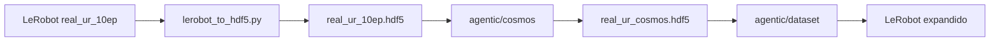

# Dataset Scripts

Ferramentas para validar datasets **LeRobot v2/v3**, converter para HDF5 (Cosmos/Mimic) e seguir o pipeline de augmentação visual do i4h-workflows.

## Instalação

```bash
cd dataset/scripts
python -m venv .venv
source .venv/bin/activate
pip install -r requirements.txt
```

Dependências: `numpy`, `pyarrow`, `h5py`, `opencv-python-headless` (ou `ffprobe` no PATH para checagem de vídeo).

## Caminhos e diretório de trabalho

Os scripts desta pasta (`validator.py`, `lerobot_to_hdf5.py`) rodam a partir de **`dataset/scripts/`**.

Os scripts do **Cosmos** e do **conversor LeRobot** do Agentic ficam em **`workflows/agentic/`** na **raiz do repositório**. Se você estiver em `dataset/scripts/`, use um destes padrões:

```bash
# Opção A — definir a raiz do repo uma vez
export REPO_ROOT="$(git -C ../.. rev-parse --show-toplevel)"
cd "$REPO_ROOT"

# Opção B — caminhos relativos a partir de dataset/scripts/
../../workflows/agentic/cosmos/run.sh --help
```

> **Erro comum:** `bash: workflows/agentic/cosmos/run.sh: No such file or directory`  
> Isso ocorre quando o comando é executado de `dataset/scripts/` sem `cd` para a raiz do repo ou sem o prefixo `../../`.

---

## Pipeline completo (LeRobot → Cosmos → LeRobot)

Exemplo com o dataset de referência [`../real_ur_10ep/`](../real_ur_10ep/) (UR7e + RH56E2, 10 episódios, 2 câmeras).



### Passo 0 — Pré-requisitos Cosmos (uma vez)

Na **raiz do repositório**:

```bash
export REPO_ROOT="$(git rev-parse --show-toplevel)"
cd "$REPO_ROOT"
```

Requer **GPU NVIDIA** e **Docker** com suporte a `--gpus`.

#### 0a. Hugging Face — licença e token (obrigatório antes do Docker)

O checkpoint **nvidia/Cosmos-Transfer2.5-2B** é um repositório **gated** no Hugging Face. Sem token autenticado você verá:

```text
Warning: You are sending unauthenticated requests to the HF Hub...
Error: Access denied. This repository requires approval.
```

**Faça nesta ordem:**

1. Crie/login em [huggingface.co](https://huggingface.co).
2. Aceite o **NVIDIA Open Model License** em **cada** repositório abaixo (mesma conta do token):
   - [nvidia/Cosmos-Transfer2.5-2B](https://huggingface.co/nvidia/Cosmos-Transfer2.5-2B) — checkpoint principal do Transfer
   - [nvidia/Cosmos-Predict2.5-2B](https://huggingface.co/nvidia/Cosmos-Predict2.5-2B) — VAE/tokenizer (`tokenizer.pth`); **obrigatório** na inferência mesmo usando só Transfer
   - [nvidia/Cosmos-Guardrail1](https://huggingface.co/nvidia/Cosmos-Guardrail1) — guardrail de texto
3. Crie um token **Read** em [huggingface.co/settings/tokens](https://huggingface.co/settings/tokens).
4. Exporte o token **no mesmo shell** em que rodará Cosmos (antes de `setup.sh`, `run-docker.sh` ou `run.sh --run-cosmos`):

```bash
export HF_TOKEN="hf_..."          # preferido pelo pipeline agentic
# ou:
export HUGGING_FACE_HUB_TOKEN="hf_..."

# Opcional: validar login e pré-baixar checkpoints no host (cache montado no Docker)
pip install -U "huggingface_hub[cli]"
hf auth login   # cola o mesmo token
hf download nvidia/Cosmos-Transfer2.5-2B --repo-type model
hf download nvidia/Cosmos-Predict2.5-2B --repo-type model
hf download nvidia/Cosmos-Guardrail1 --repo-type model
```

> O Docker monta `~/.cache/huggingface` e repassa `HF_TOKEN` para o container — defina a variável **antes** de cada comando que executa inferência Cosmos.

#### 0b. Build da imagem Docker

A imagem `cosmos-transfer-2.5` **não existe no Docker Hub**; é construída localmente:

```bash
cd "$REPO_ROOT"

workflows/agentic/setup.sh
workflows/agentic/cosmos/setup.sh
# equivalente manual:
# workflows/agentic/cosmos/scripts/build-image.sh cosmos-transfer-2.5
```

Confirme:

```bash
docker image inspect cosmos-transfer-2.5
docker run --rm --entrypoint /bin/sh cosmos-transfer-2.5 \
  -lc 'test -f /workspace/bin/entrypoint.sh && echo OK'
```

### Passo 1 — Validar o dataset LeRobot

```bash
cd "$REPO_ROOT/dataset/scripts"
source .venv/bin/activate

python validator.py --dataset-path ../real_ur_10ep --check-videos
```

### Passo 2 — Converter LeRobot → HDF5

```bash
cd "$REPO_ROOT/dataset/scripts"

python lerobot_to_hdf5.py \
  --dataset-path ../real_ur_10ep \
  --output ../real_ur_10ep/real_ur_10ep.hdf5 \
  --overwrite
```

Saída típica: **10 demos**, ~4–5 GB (com gzip), câmeras `gripper` e `up` em `obs/<camera>`.

Teste rápido (1 episódio):

```bash
python lerobot_to_hdf5.py --dataset-path ../real_ur_10ep --episode-indices 0 --overwrite
```

### Passo 3 — Cosmos Transfer (variantes visuais)

Execute na **raiz do repositório** (não em `dataset/scripts/`):

```bash
cd "$REPO_ROOT"

export HDF5_IN="$REPO_ROOT/dataset/real_ur_10ep/real_ur_10ep.hdf5"
export HDF5_OUT="$REPO_ROOT/dataset/real_ur_10ep/real_ur_cosmos.hdf5"
export COSMOS_WORKDIR="$REPO_ROOT/dataset/real_ur_10ep/cosmos_workspace"

workflows/agentic/cosmos/run.sh \
  --env scissor_pick_and_place \
  --input "$HDF5_IN" \
  --output "$HDF5_OUT" \
  --workspace "$COSMOS_WORKDIR" \
  --variants 2 \
  --fps 30 \
  --prompt "Photorealistic robotics lab with UR manipulator, varied lighting and textures" \
  --camera gripper \
  --camera up \
  --run-cosmos
```

Notas:

| Item | Detalhe |
|------|---------|
| `--env` | Obrigatório no CLI; com **caminhos absolutos** em `--input`/`--output`, o id só resolve paths relativos (`scissor_pick_and_place` serve como placeholder). |
| `--variants 2` | 2 variantes visuais **por demo e por câmera** → 10 × 2 × 2 = **40 jobs** Cosmos (+ demos originais no HDF5 final). |
| `--run-cosmos` | Roda o Docker automaticamente; sem essa flag, o script só exporta o manifest e imprime os passos manuais. |

**Modo manual** (debug):

```bash
cd "$REPO_ROOT"

workflows/agentic/cosmos/scripts/export.sh \
  --env scissor_pick_and_place \
  --input "$HDF5_IN" \
  --workspace "$COSMOS_WORKDIR" \
  --variants 2 \
  --fps 30 \
  --prompt "Photorealistic robotics lab with UR manipulator, varied lighting and textures" \
  --camera gripper --camera up

export HF_TOKEN="hf_..."   # obrigatório antes do run-docker (ver Passo 0a)

workflows/agentic/cosmos/scripts/run-docker.sh \
  --env scissor_pick_and_place \
  --manifest "$COSMOS_WORKDIR/manifest.json"

workflows/agentic/cosmos/scripts/import.sh \
  --env scissor_pick_and_place \
  --manifest "$COSMOS_WORKDIR/manifest.json" \
  --output "$HDF5_OUT"
```

### Passo 4 — HDF5 Cosmos → LeRobot

```bash
cd "$REPO_ROOT"

export HF_LEROBOT_HOME="$REPO_ROOT/dataset"

workflows/agentic/dataset/run.sh \
  --hdf5-path "$HDF5_OUT" \
  --repo-id local/real_ur_cosmos \
  --robot-type ur7e_rh56e2 \
  --fps 30 \
  --task-description "Pick up the object with the UR7e and RH56E2 hand" \
  --action-dim 12 \
  --state-dim 12 \
  --state-obs-key joint_pos \
  --cameras gripper,up \
  --overwrite
```

Copie o `modality.json` do dataset original (se as chaves de vídeo forem as mesmas):

```bash
cp "$REPO_ROOT/dataset/real_ur_10ep/meta/modality.json" \
   "$REPO_ROOT/dataset/real_ur_cosmos/meta/modality.json"
```

### Passo 5 — Regenerar stats GR00T e revalidar

No ambiente GR00T:

```bash
python gr00t/data/stats.py \
  --dataset-path "$REPO_ROOT/dataset/real_ur_cosmos" \
  --embodiment-tag new_embodiment
```

Revalidar antes do treino:

```bash
cd "$REPO_ROOT/dataset/scripts"
python validator.py --dataset-path ../real_ur_cosmos --check-videos
```

### Artefatos gerados (não versionar por padrão)

| Arquivo / pasta | Descrição |
|-----------------|-----------|
| `dataset/real_ur_10ep/real_ur_10ep.hdf5` | HDF5 intermediário (~4–5 GB) |
| `dataset/real_ur_10ep/cosmos_workspace/` | Vídeos, specs e manifest do Cosmos |
| `dataset/real_ur_10ep/real_ur_cosmos.hdf5` | HDF5 após augmentação |
| `dataset/real_ur_cosmos/` | Dataset LeRobot expandido |

Artefatos grandes (`*.hdf5`, `dataset/*` exceto `dataset/scripts/`, workspaces Cosmos) estão no `.gitignore` da raiz do repo.

---

## `validator.py`

Valida a estrutura completa de um dataset LeRobot:

| Categoria | Verificações |
|-----------|--------------|
| **Metadados** | `meta/info.json`, `episodes.jsonl`, `tasks.jsonl` |
| **GR00T** | `modality.json` (slices), `stats.json`, `relative_stats.json` (horizonte) |
| **Parquet** | Arquivos por episódio, colunas obrigatórias, shapes de `action` / `observation.state` |
| **Consistência** | `total_frames`, `episode_index`, comprimento por episódio |
| **Vídeos** | Existência, contagem de frames e resolução (com `--check-videos`) |

### Uso

```bash
# Validação rápida (sem decodificar vídeos)
python validator.py --dataset-path ../real_ur_10ep

# Validação completa (frames de vídeo vs linhas do parquet)
python validator.py --dataset-path ../real_ur_10ep --check-videos

# Falhar também em warnings
python validator.py --dataset-path ../real_ur_10ep --check-videos --strict

# Avisar se action e state divergirem além de um limiar
python validator.py --dataset-path ../real_ur_10ep --max-action-state-delta 0.05

# Saída detalhada
python validator.py --dataset-path ../real_ur_10ep --verbose
```

### Argumentos

| Flag | Descrição |
|------|-----------|
| `--dataset-path` | Raiz do dataset (contém `meta/`, `data/`, `videos/`) |
| `--check-videos` | Compara contagem de frames dos MP4 com linhas do parquet |
| `--max-action-state-delta` | Emite `WARNING` se `max \|action - state\|` exceder o valor |
| `--strict` | Exit code 1 se houver warnings |
| `--verbose` | Imprime mensagens `INFO` |

### Códigos de saída

| Código | Significado |
|--------|-------------|
| `0` | Sem erros (e sem warnings, se `--strict`) |
| `1` | Erros encontrados (ou warnings com `--strict`) |

### Exemplo de saída

```text
[INFO] summary: Validated 10 episodes, 12000 frames, 2 video streams, robot_type=ur7e_rh56e2

Result: 0 error(s), 0 warning(s) — PASS
```

### Códigos de issue comuns

| Código | Severidade | Causa típica |
|--------|------------|--------------|
| `parquet_missing` | ERROR | Episódio listado em `episodes.jsonl` sem arquivo parquet |
| `parquet_rows` | ERROR | Número de linhas ≠ `length` do episódio |
| `video_frames` | ERROR | MP4 com contagem de frames diferente do parquet |
| `modality_slice` | ERROR | Slice em `modality.json` fora do dim de action/state |
| `relative_stats_shape` | ERROR | Horizontes inconsistentes em `relative_stats.json` |
| `modality_missing` | WARNING | Sem `modality.json` (necessário para GR00T) |
| `action_state_delta` | WARNING | `action` e `state` muito diferentes no mesmo frame |

## Dataset de referência

O dataset [`../real_ur_10ep/`](../real_ur_10ep/) contém 10 episódios reais de um **UR7e + RH56E2** (12 DOF, 2 câmeras, 30 FPS). Use-o como referência de layout LeRobot v3.0:

```bash
python validator.py --dataset-path ../real_ur_10ep --check-videos
```

## `lerobot_to_hdf5.py`

Converte um dataset LeRobot v2/v3 para HDF5 no formato esperado por `workflows/agentic/cosmos/` e `workflows/agentic/mimic/`.

### Uso

```bash
# Conversão completa (10 episódios, 2 câmeras)
python lerobot_to_hdf5.py --dataset-path ../real_ur_10ep --overwrite

# Saída customizada
python lerobot_to_hdf5.py \
  --dataset-path ../real_ur_10ep \
  --output ../real_ur_10ep/real_ur_10ep.hdf5 \
  --overwrite

# Apenas alguns episódios (teste rápido)
python lerobot_to_hdf5.py --dataset-path ../real_ur_10ep --episode-indices 0,1 --overwrite

# Sem vídeos (só trajetórias; Cosmos não funcionará)
python lerobot_to_hdf5.py --dataset-path ../real_ur_10ep --no-videos --overwrite
```

### Layout HDF5 gerado

| Caminho | Conteúdo |
|---------|----------|
| `data/demo_N/obs/actions` | `(T, action_dim)` float32 |
| `data/demo_N/obs/joint_pos` | `(T, state_dim)` float32 |
| `data/demo_N/obs/<camera>` | `(T, H, W, 3)` uint8 RGB |
| `data/demo_N/@success` | `True` (padrão) |

As chaves de câmera vêm de `meta/modality.json` (`video.*.original_key`) ou, se ausente, do sufixo após `observation.images.` em `info.json`.

### Argumentos

| Flag | Descrição |
|------|-----------|
| `--dataset-path` | Raiz do dataset LeRobot |
| `--output` | Caminho `.hdf5` (padrão: `<dataset-path>/<nome>.hdf5`) |
| `--episode-indices` | Lista `0,1,2` de episódios a converter |
| `--no-videos` | Pula decodificação de MP4 |
| `--no-success` | Não define `success=True` nos demos |
| `--no-compression` | Desativa gzip nos datasets HDF5 |
| `--overwrite` | Substitui o arquivo de saída |

---

## Referência rápida de comandos

A partir da raiz do repo (`$REPO_ROOT`):

```bash
# 1. Validar
cd dataset/scripts && python validator.py --dataset-path ../real_ur_10ep --check-videos

# 2. LeRobot → HDF5
python lerobot_to_hdf5.py --dataset-path ../real_ur_10ep --overwrite

# 3. Cosmos (voltar à raiz antes deste passo)
cd "$REPO_ROOT"
workflows/agentic/cosmos/run.sh \
  --env scissor_pick_and_place \
  --input "$REPO_ROOT/dataset/real_ur_10ep/real_ur_10ep.hdf5" \
  --output "$REPO_ROOT/dataset/real_ur_10ep/real_ur_cosmos.hdf5" \
  --variants 2 --fps 30 \
  --prompt "Photorealistic robotics lab with UR manipulator, varied lighting and textures" \
  --camera gripper --camera up --run-cosmos
```

---

## Troubleshooting Cosmos

### `workflows/agentic/cosmos/run.sh: No such file or directory`

Você está em `dataset/scripts/`. Volte à raiz do repo ou use `../../workflows/agentic/cosmos/run.sh` (ver seção [Caminhos](#caminhos-e-diretório-de-trabalho)).

### `pull access denied for cosmos-transfer-2.5`

A imagem não é pública. Rode `workflows/agentic/cosmos/setup.sh` ou `scripts/build-image.sh` (Passo 0b).

### `Cosmos image is not standalone`

Mesma causa: imagem não construída ou incompleta. Alternativa: clone [cosmos-transfer2.5](https://github.com/nvidia-cosmos/cosmos-transfer2.5) e use `export COSMOS_TRANSFER_ROOT=/caminho/para/cosmos-transfer2.5` em `run-docker.sh --cosmos-root ...`.

### `Access denied. This repository requires approval` (Hugging Face)

O log indica **qual** repo falhou. Exemplo real:

```text
hf download nvidia/Cosmos-Guardrail1 ...
Error: Access denied. This repository requires approval.
```

**Causa:** licença não aceita nesse repositório (não basta aceitar só o Transfer2.5).

**Correção:**

1. Aceite a licença no repo que aparece no log — no mínimo **os três** abaixo (o log indica qual falta):
   - [nvidia/Cosmos-Transfer2.5-2B](https://huggingface.co/nvidia/Cosmos-Transfer2.5-2B)
   - [nvidia/Cosmos-Predict2.5-2B](https://huggingface.co/nvidia/Cosmos-Predict2.5-2B) — erro típico após Guardrail1 OK: `download nvidia/Cosmos-Predict2.5-2B ... tokenizer.pth`
   - [nvidia/Cosmos-Guardrail1](https://huggingface.co/nvidia/Cosmos-Guardrail1)
2. `export HF_TOKEN="hf_..."` no shell **antes** de `run-docker.sh` (o Docker repassa `-e HF_TOKEN` do host).
3. Token com permissão **Read**; se for fine-grained, habilite repositórios gated.
4. **Pré-baixe os modelos completos no host** (recomendado — evita lock e re-download em cada job Docker):

```bash
export HF_TOKEN="hf_..."
hf download nvidia/Cosmos-Transfer2.5-2B --repo-type model
hf download nvidia/Cosmos-Predict2.5-2B --repo-type model
hf download nvidia/Cosmos-Guardrail1 --repo-type model
```

5. Retome o job que falhou (`--limit 1` ou `--rerun-existing` conforme necessário).

### `Still waiting to acquire lock on .../hub/.locks/models--nvidia--Cosmos-Guardrail1/...`

**O que é:** dois processos tentam baixar o mesmo modelo para o mesmo cache Hugging Face (`~/.cache/huggingface` → montado como `/tmp/huggingface` no Docker). O download pode estar em **81%** e outro processo fica à espera do lock.

**Causas comuns:**

- Vários containers Cosmos em paralelo (`run-docker.sh --parallel 2+`) na primeira execução (antes do cache estar completo).
- `hf download` no host **ao mesmo tempo** que o Docker descarrega.
- Lock órfão de um download interrompido (Ctrl+C).

**Correção (por ordem):**

1. **Espere** — se só há um job ativo, pode concluir sozinho após o download dos 102 ficheiros.
2. **Um job de cada vez** até o cache estar cheio:

```bash
workflows/agentic/cosmos/scripts/run-docker.sh \
  --env scissor_pick_and_place \
  --manifest "$MANIFEST" \
  --parallel 1 \
  --limit 1
```

3. **Pré-baixe no host** (melhor solução antes dos 40 jobs):

```bash
export HF_TOKEN="hf_..."
hf download nvidia/Cosmos-Transfer2.5-2B --repo-type model
hf download nvidia/Cosmos-Predict2.5-2B --repo-type model
hf download nvidia/Cosmos-Guardrail1 --repo-type model
```

4. **Pare duplicados** — não corra dois `run-docker.sh` / `run.sh --run-cosmos` em terminais diferentes ao mesmo tempo.

```bash
docker ps   # containers cosmos-transfer a correr
# Ctrl+C no terminal do job extra, ou docker stop <id>
```

5. **Lock órfão** (só se não houver download/docker ativo):

```bash
rm -f ~/.cache/huggingface/hub/.locks/models--nvidia--Cosmos-Guardrail1/*.lock
rm -f ~/.cache/huggingface/hub/.locks/models--nvidia--Cosmos-Transfer2.5-2B/*.lock
```

Depois volte a correr com `--parallel 1` até `hf download` no host terminar; só então aumente `--parallel` se precisar de mais throughput.

### Export concluído (`export demos: 10/10`) mas Docker falhou

Não refaça o export. Use o manifest já gerado (sem `--workspace` na CLI, o padrão é `real_ur_cosmos_cosmos_workdir` ao lado do HDF5 de saída):

```bash
export REPO_ROOT="$(git rev-parse --show-toplevel)"
export HF_TOKEN="hf_..."
export MANIFEST="$REPO_ROOT/dataset/real_ur_10ep/real_ur_cosmos_cosmos_workdir/manifest.json"
# ou, se você passou --workspace explicitamente:
# export MANIFEST="$REPO_ROOT/dataset/real_ur_10ep/cosmos_workspace/manifest.json"

ls -la "$MANIFEST"

workflows/agentic/cosmos/scripts/run-docker.sh \
  --env scissor_pick_and_place \
  --manifest "$MANIFEST" \
  --limit 1    # teste com 1 job antes dos 40

workflows/agentic/cosmos/scripts/import.sh \
  --env scissor_pick_and_place \
  --manifest "$MANIFEST" \
  --output "$REPO_ROOT/dataset/real_ur_10ep/real_ur_cosmos.hdf5"
```
