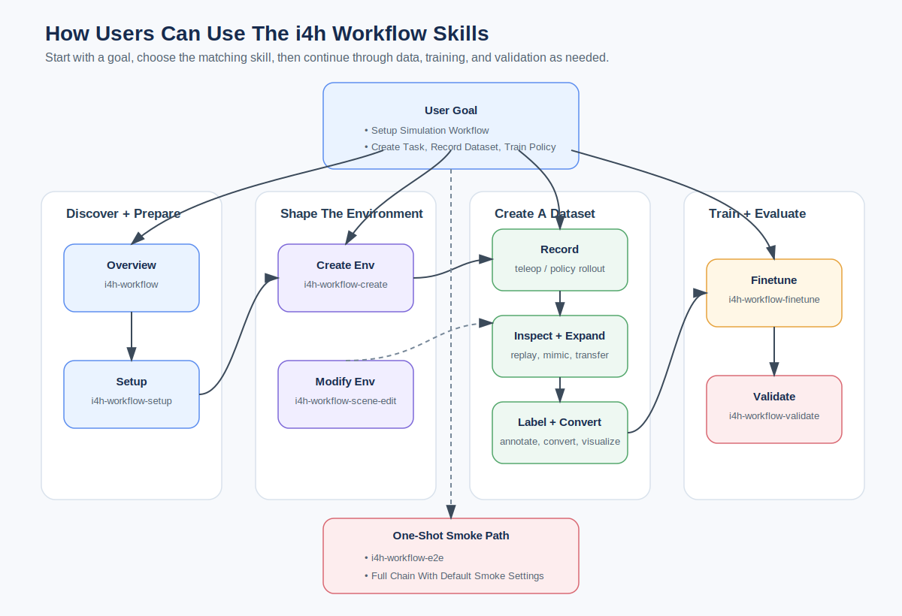
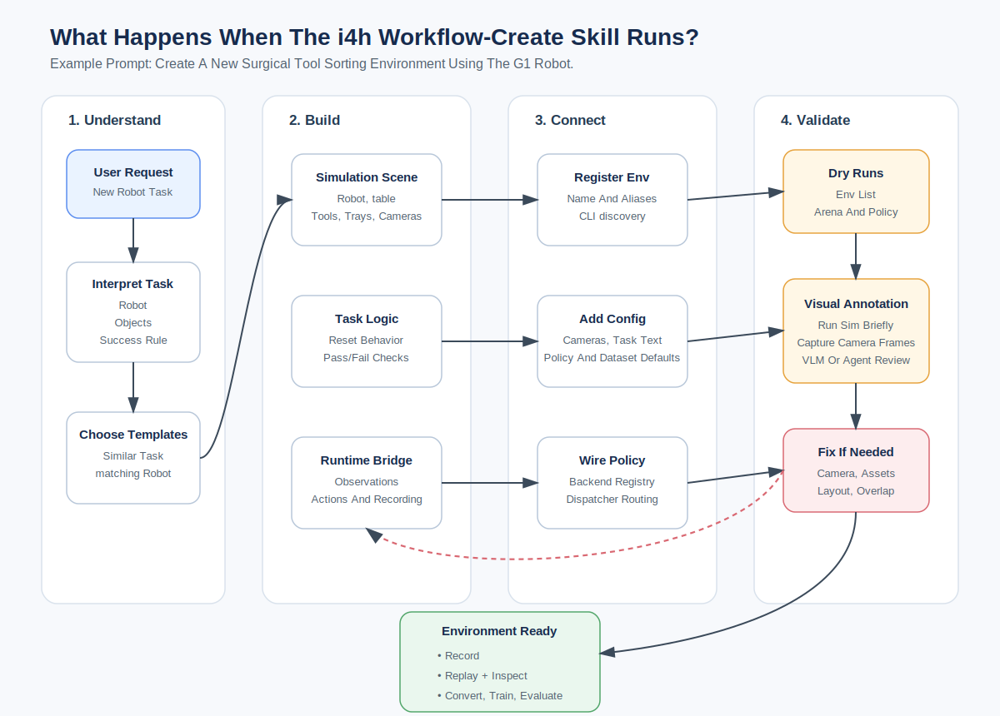
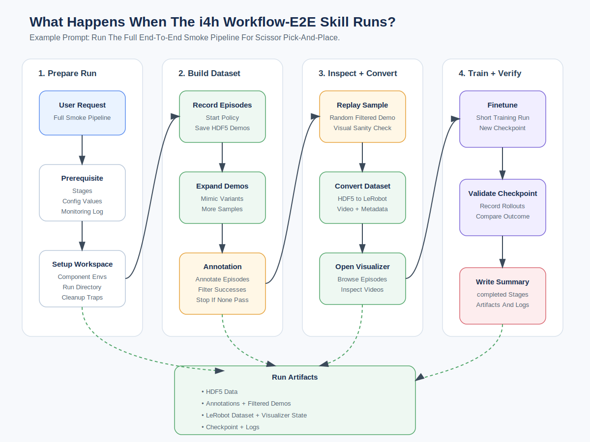

# Agentic Workflow

Unified IsaacLab-Arena + GR00T/openpi policy workflow with five pre-trained environments.

## Requirements

Before running `setup.sh`:

- Ubuntu 22.04 or 24.04 on `x86_64` or `aarch64`.
- `uv` on `PATH`.
- `git` on `PATH` for third-party checkouts.
- Network access to GitHub, PyPI, NVIDIA PyPI, and PyTorch CUDA wheels.
- NVIDIA GPU with Linux driver `580.65.06` or newer for Isaac Sim 5.1 / CUDA 13.
- ~30 GB free disk
- Optional Cosmos visual expansion: Docker with GPU support, plus `HF_TOKEN` or
  `HUGGING_FACE_HUB_TOKEN` after accepting the NVIDIA Cosmos model license.

## Setup

```bash
workflows/agentic/setup.sh
```

Cosmos is optional because it may build/check a Docker image:

```bash
workflows/agentic/setup.sh --with-cosmos
```

## Supported Environments

| Env id | Robot | HF model |
| --- | --- | --- |
| `scissor_pick_and_place` | SO-ARM 101 | `nvidia/SO_ARM_Starter_Gr00t` (N1.7 alt: `nvidia/SO_ARM_Starter_Gr00tN17`) |
| `locomanip_tray_pick_and_place` | Unitree G1 | `nvidia/GR00T-N1.6-Rheo-PickNPlaceTray` |
| `locomanip_push_cart` | Unitree G1 | `nvidia/GR00T-N1.6-Rheo-Sim-PushCart` |
| `assemble_trocar` | Unitree G1 | `nvidia/GR00T-N1.5-RL-Rheo-AssembleTrocar` |
| `ultrasound_liver_scan` | Franka-style arm | `nvidia/Liver_Scan_Pi0_Cosmos_Rel` |

## Subprojects

- [`arena/`](arena/) — Simulator entry point for registered environments, policy rollouts, teleop recording, and HDF5 replay.
- [`policy/`](policy/) — Env-to-policy dispatcher for GR00T/openpi inference daemons and training CLIs.
- [`mimic/`](mimic/) — Lightweight HDF5 demo expansion by copying trajectories and adding small action/state noise.
- [`dataset/`](dataset/) — Arena HDF5 to LeRobot dataset conversion, including metadata, videos, and modality defaults.
- [`annotator/`](annotator/) — VLM-based success labeling for recorded episodes and live camera frames.
- [`cosmos/`](cosmos/) — Optional NVIDIA Cosmos Transfer pipeline for visual variation of recorded camera streams.

Each environment is configured by one YAML file in [`config/environments/`](config/environments/).

## Quick Run

Try following prompts in your claude code.

> When running Claude Code for these skills/prompts, use effort level to **`medium`** (balanced approach for speed vs performance).

Each block below is one or more **natural-language prompts to paste into Claude Code** — not shell commands. Claude Code loads the matching skill from the table further down to execute them. Estimates are for *cached* re-runs; first runs are typically 5–10x longer due to model and Isaac Sim asset downloads.

### Existing Environments

```text
# Setup (~2 mins)
What does the i4h workflow include, and where should I start?
Set up the i4h workflow on this machine and tell me if any host requirements are missing.

# Run Evaluation (using pretrained HF models)
# (~3 mins with isaacsim first launch)
Evaluate scissor pick and place for 2 episodes.
Replay second episode.

# Dataset/VLM Annotation (using Qwen3-VL-8B)
# (~2 mins with local VLM)
Run Annotation on all recorded episodes and summarize.

# Run Evaluation for others (using pretrained HF models)
# (~2 mins per env)
Evaluate ultrasound for 1 episode.
Evaluate trocar assembly for 1 episode.
Evaluate locomanip tray pick and place for 1 episode.
Evaluate locomanip push cart for 1 episode.

# Run E2E (record -> mimic -> annotate/filter -> replay -> convert -> visualize -> finetune -> validate)
# (~10 mins)
Run end-to-end smoke pipeline for scissor pick-and-place.

# Stop
Stop all
```

### Creating New Environment

```text
# Create env/workflow: (scissor_pick_and_place → Unitree G1 → gr00t_n16 → nvidia/GR00T-N1.6-3B)
# (~10 mins)
Create a new i4h environment for surgical tool sorting using G1 based on scissor_pick_and_place.

# Edit Scene (~4 mins)
Launch the new env in edit mode.
  - Add new red cube with gravity to stay on table.
  - Shift G1 to the opposite side of the table and 4 ft away from table.
  - Add a room camera based on perspective view.
  - Bake all changes and exit.

# Teleop/Finetune/Eval (~20 mins)
Add room camera input to be part of dataset + policy.
Change policy task description to "Walk towards surgical table"

Run teleop for 5 episodes.
Mimic 3 more episodes and visualize my dataset.
Finetune for 200 steps with batch size of 32.  Turn off vision tuning.
Run eval using new checkpoint for 300 timesteps.

# Stop
Stop all
```

## Workflow Skills

Use these prompts with the repository skills in `.claude/skills/`.
> **Status legend**: ✓ verified, ◐ partial / known limitations, ○ not verified.

| Skill | Description | Example prompt |
| --- | --- | --- |
| ✓ [`i4h-workflow`](../../.claude/skills/i4h-workflow/SKILL.md) | Overview of the unified IsaacLab-Arena + GR00T/openpi workflow and where to start. | `What does the i4h workflow include, and where should I start?` |
| ✓ [`i4h-workflow-setup`](../../.claude/skills/i4h-workflow-setup/SKILL.md) | Verify host requirements and run setup. | `Set up the i4h workflow on this machine and tell me if any host requirements are missing.` |
| ✓ [`i4h-workflow-create`](../../.claude/skills/i4h-workflow-create/SKILL.md) | Create a new agentic environment from an existing template, including scene, task, YAML, and policy registration. | SO-ARM 101: `Create a new i4h environment by forking the scissor pick-and-place task for surgical tool sorting.`<br><br>G1: `Create a new i4h environment by forking the scissor pick-and-place task for surgical tool sorting using G1 robot.` |
| ✓ [`i4h-workflow-scene-edit`](../../.claude/skills/i4h-workflow-scene-edit/SKILL.md) | Edit an existing environment's scene in place, such as moving/scaling objects, swapping props, adjusting cameras, robot placement, task language, success bounds, or randomization. | `Edit the scissor pick-and-place scene to replace the scissors with a red cube and save the scene.` |
| ◐ [`i4h-workflow-dataset-teleop`](../../.claude/skills/i4h-workflow-dataset-teleop/SKILL.md) | Record teleoperated Arena episodes into HDF5 using keyboard or the SO-ARM leader arm. | `Record 5 keyboard teleop demos for the scissor pick-and-place task.` |
| ✓ [`i4h-workflow-dataset-replay`](../../.claude/skills/i4h-workflow-dataset-replay/SKILL.md) | Replay recorded HDF5 episodes inside Isaac Sim for visual verification. | `Replay episode 0 from my scissor pick-and-place recording in Isaac Sim.` |
| ✓ [`i4h-workflow-dataset-mimic`](../../.claude/skills/i4h-workflow-dataset-mimic/SKILL.md) | Expand an HDF5 recording by copying trajectories and adding small action/state noise. | `Expand my scissor pick-and-place recording to 10 episodes with small action and state noise.` |
| ○ [`i4h-workflow-dataset-transfer`](../../.claude/skills/i4h-workflow-dataset-transfer/SKILL.md) | Use NVIDIA Cosmos Transfer to add visual variation to HDF5 camera streams without changing actions or states. | `Use Cosmos Transfer to create 2 hospital-lighting visual variants of my scissor pick-and-place recording.` |
| ✓ [`i4h-workflow-dataset-annotate`](../../.claude/skills/i4h-workflow-dataset-annotate/SKILL.md) | Use a VLM to label whether HDF5 episodes or live camera frames satisfy the task. | `Run the VLM annotator on my scissor pick-and-place recording and label which episodes satisfy the task.` |
| ✓ [`i4h-workflow-dataset-convert`](../../.claude/skills/i4h-workflow-dataset-convert/SKILL.md) | Convert an Arena HDF5 recording into a LeRobot dataset for visualization or training. | `Convert my scissor pick-and-place recording into a LeRobot dataset.` |
| ✓ [`i4h-lerobot-viz`](../../.claude/skills/i4h-lerobot-viz/SKILL.md) | Serve the LeRobot HTML visualizer for inspecting converted datasets in a browser. | `Serve the LeRobot visualizer for my converted scissor pick-and-place dataset and show me the local URL.` |
| ◐ [`i4h-workflow-finetune`](../../.claude/skills/i4h-workflow-finetune/SKILL.md) | Fine-tune a GR00T or openpi PI0 policy on a converted LeRobot dataset. | `Fine-tune a policy for the scissor pick-and-place task on my converted dataset for a short smoke run.` |
| ✓ [`i4h-workflow-validate`](../../.claude/skills/i4h-workflow-validate/SKILL.md) | Evaluate a configured policy or checkpoint by recording rollout episodes; annotate only when requested. | `Evaluate scissor pick and place with 3 episodes.` |
| ◐ [`i4h-workflow-e2e`](../../.claude/skills/i4h-workflow-e2e/SKILL.md) | Run the full smoke pipeline from setup and recording through mimic, annotation, conversion, finetuning, and validation. | `Run the full end-to-end smoke pipeline for the scissor pick-and-place task.` |

Additional Notes:

- ◐ `i4h-workflow-dataset-teleop`: keyboard ✓, keyboard_23 ✓, so-arm-leader ✓, manus-gloves ✗
- ◐ `i4h-workflow-finetune`: scissor_pick_and_place ✓, others ✗
- ◐ `i4h-workflow-e2e`: scissor_pick_and_place ✓, others ✗
- ○ `i4h-workflow-dataset-transfer`: not verified

## Quick E2E CLI Run

```bash
workflows/agentic/scripts/e2e/run.sh --env scissor_pick_and_place --dry-run
```

```bash
workflows/agentic/scripts/e2e/run.sh --env scissor_pick_and_place --skip-mimic --skip-annotate --skip-replay --skip-viz
```

```bash
tail -f workflows/agentic/runs/.latest/logs/workflow.log
```

## Appendix






